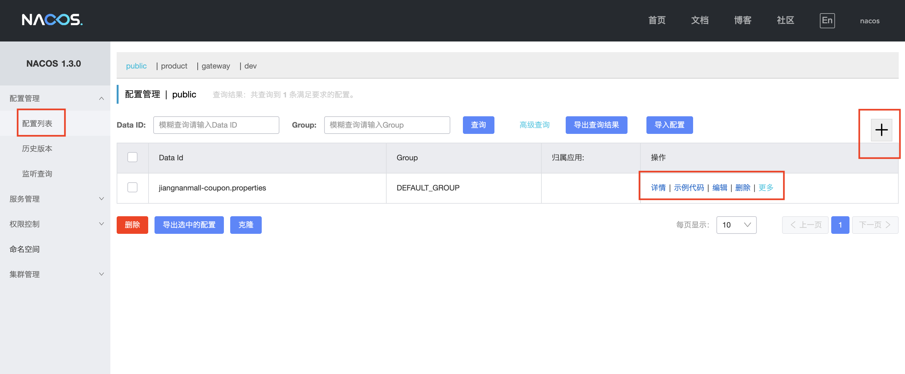
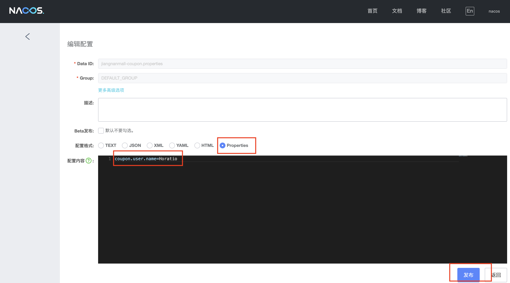
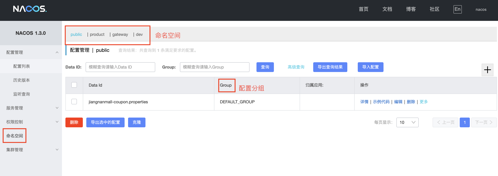

## 分布式基础

微服务：一组小型服务，每个小服务都有自己的进程，通过http的方式进行互通,每一个功能单元都是可以独立升级、替换软件单元,部署和运维困难

节点：集群中的一个服务器

集群化：几台服务器集中在同一个地方，实现同一个业务

分布式：将不同的业务分布在不同的地方

远程调用：分布式系统中各服务位于不同主机，服务间需要相互调用

负载均衡：不要让任何一台机器太忙太空，轮询、最小链接、散列（同一个用户的请求到同一台服务器）

注册中心：让其他服务实时感知本服务的状态

配置中心：让每一个服务在配置中心获取自己的配置

熔断：设置服务超时，当调用失败的次数到达某一个阈值，就采用熔断机制，返回默认值（sentinel）

降级：高峰期，业务紧张，非核心业务降级，返回默认值或者简单处理

API网关：同时可以处理负载均衡、统一认证、熔断、限流、动态路由

消息队列：异步解耦，分布式事务的一致性

## 微服务架构

nacos 配置中心配置中心

ribbon 负载均衡

feign 微服务之间远程调用

sentinel 熔断降级限流

seata 分布式事务

gateway 网关

sleuth zipkin 调用链监控 prometheus grafana

OAuth2 认证功能

服务追踪：zipkin、sleuth

## 注册中心


http://localhost:8848/naco

https://nacos.io/en-us/docs/quick-start.html

### pom

```xml
<dependency>
    <groupId>com.alibaba.cloud</groupId>
    <artifactId>spring-cloud-starter-alibaba-nacos-discovery</artifactId>
    <version>${latest.version}</version>
</dependency>


```

### application.properties

```bash
server.port=8070
spring.application.name=service-provider
spring.cloud.nacos.discovery.server-addr=127.0.0.1:8848
```

### Application

```java
@EnableDiscoveryClient //in Application
```

## 远程调用

feigh使用http，整合了Ribbon和Hystrix

### pom

```xml
<dependency>
    <groupId>org.springframework.cloud</groupId>
    <artifactId>spring-cloud-starter-openfeign</artifactId>
</dependency>

```

### application.yml

```yaml
spring:
  datasource:
    username: root
    password: root
    url: jdbc:mysql://127.0.0.1:3306/ums
    driver-class-name: com.mysql.cj.jdbc.Driver

  cloud:
    nacos:
      discovery:
        server-addr: 127.0.0.1:8848
  application:
    name: jiangnanmall-member

```

### CouponFeignService

```java
package com.baimahu.jiangnanmall.member.feign;

import com.baimahu.common.utils.R;
import org.springframework.cloud.openfeign.FeignClient;
import org.springframework.web.bind.annotation.RequestMapping;

@FeignClient("jiangnanmall-coupon")//nacos中注册的服务名称
public interface CouponFeignService {
    @RequestMapping("coupon/coupon/member/list")//完整的路径
    public R memberCoupon();
}
```

### Application

```java
@EnableFeignClients(basePackages = "com.baimahu.jiangnanmall.member.feign")
```

### Controller

```java
    @Autowired
    private CouponFeignService couponFeignService;

    @RequestMapping("/coupons")
    public R getCoupons() {
        MemberEntity memberEntity = new MemberEntity();
        memberEntity.setNickname("junye");

        R memberCoupon = couponFeignService.memberCoupon();
        return R.ok().put("member", memberEntity).put("coupons", memberCoupon.get("coupons"));

    }

```


## 配置中心

### pom

```xml
<dependency>
    <groupId>com.alibaba.cloud</groupId>
    <artifactId>spring-cloud-starter-alibaba-nacos-config</artifactId>
</dependency>

```


### bootstrap.properties

```bash
spring.application.name=jiangnanmall-coupon
spring.cloud.nacos.config.server-addr=127.0.0.1:8848
spring.cloud.nacos.config.namespace=c53c3f48-953f-4937-b13b-98661a7867c4
spring.cloud.nacos.config.group=DEFAULT_GROUP
```


### Nacos







### Controller

```java
@RefreshScope //alongside with @RequestMapping

@Value("${coupon.user.name}") //in class or function
private String name;

```

### 配置文件

#### 名词与一般使用方法

每个微服务都有自己的命名空间，使用配置分组来区分环境
配置集：所有配置的集合
配置集ID：配置名




#### 日志查看

```bash
2020-11-03 23:59:16.015  WARN 19150 --- [           main] c.a.c.n.c.NacosPropertySourceBuilder     : Ignore the empty nacos configuration and get it based on dataId[jiangnanmall-coupon] & group[DEFAULT_GROUP]

2020-11-03 23:59:21.753  INFO 19150 --- [           main] c.a.nacos.client.config.impl.CacheData   : [fixed-127.0.0.1_8848-c53c3f48-953f-4937-b13b-98661a7867c4] [add-listener] ok, tenant=c53c3f48-953f-4937-b13b-98661a7867c4, dataId=jiangnanmall-coupon, group=DEFAULT_GROUP, cnt=1
```

#### 加载多配置集

```bash
spring.cloud.nacos.config.extension-configs[0].data-id=datasource.yml
spring.cloud.nacos.config.extension-configs[0].group=dev
spring.cloud.nacos.config.extension-configs[1].refresh=true
```

## Gateway

当请求进来时通过断言判断是不是符合某一个路由规则，如果符合，经过过滤器去往指定的地方
https://docs.spring.io/spring-cloud-gateway/docs/2.2.5.RELEASE/reference/html/#the-removerequestheader-gatewayfilter-factory

### pom

```xml
<dependency>
    <groupId>org.springframework.cloud</groupId>
    <artifactId>spring-cloud-starter-gateway</artifactId>
</dependency>
```

### 不需要database

```java
@SpringBootApplication(exclude = DataSourceAutoConfiguration.class)
```

### application.yml

```yaml
spring:
  cloud:
    gateway:
      routes:
        - id: test_route
          uri: https://www.baidu.com
          predicates:
            - Query=url,baidu
        - id: test_qq
          uri: https://www.qq.com
          predicates:
            - Query=url,qq
        - id: product
          uri: lb://product
          predicates:
            - Path=/api/product/**
          filters:
            - RewritePath=/api/product/(?<segment>/?.*), /product/$\{segment}
        - id: admin_route
          uri: lb://renren-fast
          predicates:
            - Path=/api/**
          filters:
            - RewritePath=/api(?<segment>/?.*), /renren-fast/$\{segment}

```

http://localhost:88/api ---->lb://renren-fast/renren-fast
http://localhost:88/api/product/category/list/tree --->lb://product/product/category/list/tree

## 跨域

协议、域名、端口一个不一样，非简单请求会有跨域问题，客户端会发送一个OPTION

cros https://developer.mozilla.org/zh-CN/docs/Web/HTTP/Access_control_CORS
spring-cloud-gateway https://cloud.spring.io/spring-cloud-static/spring-cloud-gateway/2.2.3.RELEASE/reference/html/

### 报错

```bash
Access to XMLHttpRequest at 'http://localhost:88/api/sys/login' from origin 'http://localhost:8001' has been blocked by CORS policy: Response to preflight request doesn't pass access control check: No 'Access-Control-Allow-Origin' header is present on the requested resource.

```

### cros配置

```java
package com.baimahu.jiangnanmall.gateway.config;

import org.springframework.context.annotation.Bean;
import org.springframework.context.annotation.Configuration;
import org.springframework.web.cors.CorsConfiguration;
import org.springframework.web.cors.reactive.CorsWebFilter;
import org.springframework.web.cors.reactive.UrlBasedCorsConfigurationSource;

@Configuration
public class GatewayCorsConfiguration {

    @Bean
    public CorsWebFilter corsWebFilter() {
        UrlBasedCorsConfigurationSource source = new UrlBasedCorsConfigurationSource();
        CorsConfiguration configuration = new CorsConfiguration();

        configuration.addAllowedHeader("*");
        configuration.addAllowedMethod("*");
        configuration.addAllowedOrigin("*");
        configuration.setAllowCredentials(true);
        source.registerCorsConfiguration("/**", configuration);
        return new CorsWebFilter(source);
    }
}

```


## product

SPU standard product unit，同一个SPU有相同的规格参数
SKU stock keeping unit，不同的SKU有不同的销售属性

product服务数据库：

| 属性相关表                  | 分类和品牌表                | SKU相关表              | SPU相关表              |
| --------------------------- | --------------------------- | ---------------------- | ---------------------- |
| AttrEntity                  | BrandEntity                 | SkuInfoEntity          | SpuInfoEntity          |
| AttrGroupEntity             | CategoryEntity              | SkuImagesEntity        | SpuImagesEntity        |
| AttrAttrgroupRelationEntity | CategoryBrandRelationEntity | SkuSaleAttrValueEntity | ProductAttrValueEntity |
|                             |                             | CommentReplayEntity    | SpuCommentEntity       |


| CategoryEntity                |
| ----------------------------- |
| cat_id                        |
| name                          |
| parent_cid                    |
| catLevel                      |
| sort                          |
| List<CategoryEntity> children |

   

## 分页查询及模糊查询

Query类中调用getPage函数实现对分页对查询，params中传入page和limit用于划分分页。通过如下请求可以取第二页中的五个实例：http://127.0.0.1:4000/product/category/list?page=2&limit=5

Page类中存储records（List<T>），total，current和size等参数

QueryWrapper用于定义sql的查询条件

 * @param page         分页查询条件（可以为 RowBounds.DEFAULT）
 * @param queryWrapper 实体对象封装操作类（可以为 null 模糊查询条件）

```java
//无模糊查询条件 
public PageUtils queryPage(Map<String, Object> params) {
     IPage<CategoryEntity> page = this.page(
             new Query<CategoryEntity>().getPage(params),
             new QueryWrapper<CategoryEntity>()
     );
     return new PageUtils(page);
 }

```

```java
//有模糊查询条件，根据brand_id和name
public PageUtils queryPage(Map<String, Object> params) {
    String key = (String) params.get("key");
    QueryWrapper<BrandEntity> wrapper = new QueryWrapper<>();
    if (!StringUtils.isEmpty(key)) {
        wrapper.and(obj -> obj.eq("brand_id", key)).or().like("name", key);
    }
    IPage<BrandEntity> page = this.page(
            new Query<BrandEntity>().getPage(params),
            wrapper
    );
    return new PageUtils(page);
}
```


首先定义好page和queryWrapper，接下来使用ServiceImpl类将从sql中获取的数据填充到page中，并返回

## 三级分类

通过循环递归的方式组成树形结构

```java
public List<CategoryEntity> listWithTree() {
    List<CategoryEntity> entities = baseMapper.selectList(null);
    List<CategoryEntity> level1Menus = entities.stream()
            .filter(categoryEntity -> categoryEntity.getParentCid() == 0)
            .map(menu -> {menu.setChildren(getChildren(menu, entities)); return menu;})
            .sorted((menu1, menu2) -> {return (menu1.getSort() == null? 0 : menu1.getSort()) - (menu2.getSort() == null? 0 : menu2.getSort());})
            .collect(Collectors.toList());
    return level1Menus;
}
```

```java
private List<CategoryEntity> getChildren(CategoryEntity parent, List<CategoryEntity> all) {
    return all.stream()
            .filter(categoryEntity -> categoryEntity.getParentCid().equals(parent.getCatId()))
            .map(categoryEntity -> {categoryEntity.setChildren(getChildren(categoryEntity, all)); return categoryEntity;})
            .sorted((menu1, menu2) -> {return (menu1.getSort() == null? 0 : menu1.getSort()) - (menu2.getSort() == null? 0 : menu2.getSort());})
            .collect(Collectors.toList());
}
```


新增删除需要isAuth return true

node：当前节点的值

data：从数据库中获取的节点的内容

show-checkbox：显示选择框

node-key：唯一标识

## MybatisPlus

增加逻辑删除配置：

```yml
mybatis-plus:
  mapper-location: classpath:/mapper/**/*.xml
  global-config:
    db-config:
      id-type: auto
      #logic-del  ete-field: flag  # 全局逻辑删除的实体字段名(since 3.3.0,配置后可以忽略不配置步骤2)
      logic-delete-value: 0 # 逻辑已删除值(默认为 1)
      logic-not-delete-value: 1 # 逻辑未删除值(默认为 0)
```

在entity中增加注解：

```java
@TableLogic
private Integer showStatus;
```


expandedkey

前端页面删除

```vue
remove(node, data) {
  var ids = [data.catId];
  //确认弹框
  this.$confirm(`此操作将永久删除${data.name}, 是否继续?`, "提示", {
    confirmButtonText: "确定",
    cancelButtonText: "取消",
    type: "warning"
  })
    .then(() => {
      this.$http({
        url: this.$http.adornUrl("/product/category/delete"),
        method: "post",
        data: this.$http.adornData(ids, false)
      }).then(({ data }) => {
        if (data && data.code === 0) {
          //消息提示
          this.$message({
            message: "操作成功",
            type: "success",
            duration: 1500,
            onClose: () => {
              this.getDataList();
            }
          });
          //刷新菜单
          this.getMenus();
          //展开的节点
          this.expandedKey = [node.parent.data.catId];
        } else {
          this.$message.error(data.msg);
        }
      });
      this.$message({
        type: "success",
        message: "删除成功!"
      });
    })
    .catch(() => {
      this.$message({
        type: "info",
        message: "已取消删除"
      });
    });
  console.log("remove data node", node, data);
},
```

